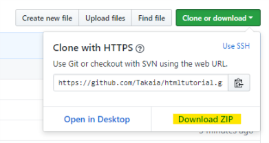

# HTML tutorial
An html/css tutorial/example for teaching friends the super basics of coding websites

## getting started
1. Download this repository's zip file, or if you're feeling ambitious you can ask me to teach you how to use git!

2. you can now open `index.html` from the file explorer to view the example html page!
3. open the `htmltutorial` folder in your favorite text editor (try [Atom](https://atom.io/) if you don't know which editor to use) to begin playing with and editing the HTML
4. don't forget to save! Then you can open whatever file you edited from the file explorer, which should open into your browser, and then you can view your changes. Once you've opened a certain page, you can keep it open and just **refresh** the page each time you save to see new changes

### just need a starting point?
If you're ready to get started coding your page instead of using the examples, you can copy the `template.html` file contents as a good base HTML template without most of the filler.

### what does the `.htaccess` file do?
Right now, it's already set up to forward all traffic to your URL to https:// instead of http://
